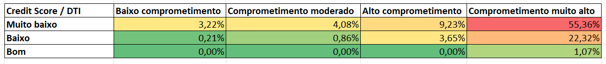

# Análise de Risco de Crédito
Análise exploratória, de associação e de correlação aplicada a dados de empréstimos e risco de crédito utilizando Excel.

## Sobre o Projeto

Este projeto apresenta uma análise exploratória, de correlação e de associação (Information Value) de uma base de dados relacionada a empréstimo e risco de crédito.
A base de dados é sintética (não possui dados reais), mas é baseada em comportamentos reais de empréstimos e usada para fins de análise, educação e práticas de modelagem preditiva.

Fonte: https://www.kaggle.com/datasets/deepakkaushal/financial-loan-credit-risk-dataset

Baixada em 07/09/2026

### Variáveis na base de dados (metadados)

**Loan_ID:** Identificador exclusivo atribuído a cada solicitação de empréstimo individual.

**Application_Date:** Data exata em que a solicitação foi enviada.

**Customer_Age:** Idade do principal solicitante do empréstimo.

**Gender:** Gênero informado pelo solicitante.

**Marital_Status:** Estado civil do solicitante.

**Education_Level:** Maior nível de escolaridade alcançado pelo solicitante.

**Employment_Type:** Situação profissional ou cargo corporativo do solicitante.

**Annual_Income:** Renda anual verificada do solicitante, expressa em unidades monetárias padrão.

**Credit_Score:** Pontuação numérica de crédito que avalia a capacidade de crédito do solicitante.

**Existing_Loans_Count:** Número de empréstimos ativos ou preexistentes que o solicitante possui atualmente em instituições financeiras.

**Number_of_Dependents:** Número de familiares ou dependentes legais que dependem da renda do solicitante.

**Home_Ownership:** Situação habitacional do solicitante.

**Region:** Localização geográfica ou continente de onde a solicitação foi enviada.

**Loan_Purpose:** Principal finalidade para a qual o empréstimo está sendo solicitado.

**Loan_Amount:** Valor monetário total solicitado para o empréstimo.

**Loan_Term_Months:** Duração total do contrato de empréstimo, especificada em meses.

**Interest_Rate:** Taxa percentual de juros associada ao empréstimo solicitado.

**Monthly_Installment:** Valor calculado da parcela mensal para o pagamento do empréstimo.

**Debt_to_Income_Ratio:** Razão entre o total das obrigações mensais de dívida do solicitante e sua renda mensal bruta, expressa em porcentagem.

**Loan_Status:** Resultado operacional da solicitação de empréstimo.

**Repayment_Status:** Resultado histórico ou final de como o empréstimo está sendo pago.

## Objetivos

O objetivo desse projeto é responder a seguinte pergunta de negócio:

**Quais características dos clientes e dos empréstimos estão associadas à aprovação ou rejeição de uma solicitação de crédito?**

Para responder a essa pergunta, faremos inicialmente uma análise exploratória dos dados abordando as principais variáveis relacionadas a risco de crédito:

**Perfil do Cliente:** Customer_Age, Education_Level, Employment_Type, Home_Ownership.

**Perfil financeiro do cliente:** Annual_Income, Credit_Score, Debt_to_Income_Ratio, Existing_Loans_Count.

**Características do empréstimo:** Loan_Amount, Loan_Term_Months, Interest_Rate, Monthly_Installment, Loan_Purpose.

Depois dessa análise exploratória, faremos uma análise de correlação entre as variáveis numéricas da base de dados.

Após essa análise de correlação, faremos o cálculo do Information Value das variáveis que possuem maior poder preditivo em relação á rejeição ou aprovação do empréstimo.

Em seguida calcularemos o R² (coeficiente de determinação) para avaliar a associação entre algumas variáveis.

Por fim, vamos cruzar os dados de Credit_Score e Debt_to_Income (DTI) para verificar a taxa de rejeição combinando essas variáveis.

## Principais Insights

1. O comprometimento da renda está fortemente associado à rejeição

| Faixa de DTI | Taxa de rejeição |
|---|---:|
| < 20% | 0,2% |
| 20–30% | 0,2% |
| 30–40% | 1,9% |
| 40–50% | 4,4% |
| 50–60% | 3,4% |
| 60–70% | 12,0% |
| 70–80% | 24,8% |
| > 80% | **31,9%** |

Além disso, o Information Value (IV) = 3,65, indicando forte poder de discriminação na amostra.

2. O Crédit Score apresenta uma forte associado à rejeição.

| Faixa de Credit Score | Taxa de rejeição |
|---|---:|
| < 600 | **41,5%** |
| 600–649 | 9,2% |
| 650–699 | 1,9% |
| 700–749 | 0,4% |
| 750–799 | 0,0% |
| ≥ 800 | 0,0% |

O Information Value (IV) = 2,39 indica uma forte associação à rejeição.

3. Credit Score e DTI, analisados conjuntamente, permitem identificar perfis distintos

